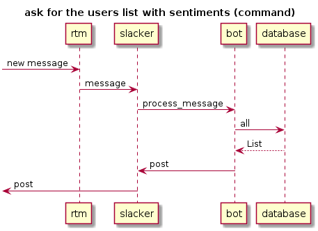

# Documentation
1. Supervision Tree
2. Modules
3. Protocol
4. Sequence diagram
5. Dependencies

## Supervision Tree
Like any other OTP application, our bot is composed of _supervisors_ and _workers_ that are organized into a supervision tree:

- `sentibot_app`
  - `sentibot_sup`
    - `sb_sentimental`
    - `sb_database`
    - `sb_slacker`
    - `sb_rtm`
    - `sb_bot`

## Modules
The supervision tree is composed of those modules:

| Module | Kind | Behaviour | Description |
| ------ | ---- | ------------- | ----------- |
| `sentibot_app` | - | `application` | Entry point |
| `sentibot_sup` | supervisor | `supervisor` | Top level supervisor |
| `sb_sentimental` | worker | `gen_server` | Sentimental analysis |
| `sb_database` | worker | `gen_server` | Store users's sentiments |
| `sb_slacker` | worker | `gen_server` | Connect to the Slack team |
| `sb_rtm` | worker | `websocket_client_handler` | _Real-Time Messaging_ |
| `sb_bot` | worker | `gen_server` | Bot logics |

## Protocol

| Module | Request | Reply | Description |
| ------ | ------- | ----- | ----------- |
| `sb_sentimental` | `{message, Msg}` | `[Sentiment]` | Return sentiments found into `Msg :: string()` as a list of `Sentiment :: string()` |
| `sb_database` | `{get, User}` | `{User, [Sentiment]}` | Get a list of `Sentiment :: string()` for the user `User :: string()` |
| `sb_database` | `{set, User, [Sentiment]}` | - | Set a list of `Sentiment :: string()` for the user `User :: string()` |
| `sb_database` | `all` | `[{User, [Sentiment]}]` | Return a list of all users with their sentiments, in a tuple `{User :: string(), [Sentiment :: string()]}` |
| `sb_slacker` | `get_rtm_url` | `Url` | Return a RTM url as `string()` |
| `sb_slacker` | `{message, Msg}` | - | A message was received as a `map()` |
| `sb_slacker` | `{post, Channel, Text}` | - | Post a `Msg :: string()` on the channel `Channel :: string()` |
| `sb_bot` | `{process_message, Channel, User, Text}` | - | Process the bot logic |

## Sequence diagram
Startup:

A classic message is posted by a user:

A user asks for the users list:

## Dependencies
- [slacker](https://github.com/julienXX/slacker) - Erlang Slack REST API wrapper
- [lager](https://github.com/erlang-lager/lager) - A logging framework for Erlang/OTP
- [websocket_client](https://github.com/jeremyong/websocket_client) - Erlang websocket client (ws and wss supported)
- [jsx](https://github.com/talentdeficit/jsx) - an erlang application for consuming, producing and manipulating json. inspired by yajl
