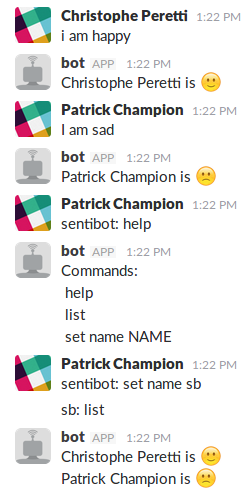

# slack-sentimental-bot
A Slack bot for sentiment analysis, for the course MCS at HEIG-VD.

## Features
- Sentimental analysis
- Change the name of the bot
- Get a list of all users

## Getting started
Open your favorite terminal and typ:
- `cd /PATH/TO/SENTIBOT/`
- `echo '"YOUR_TOKEN".' > priv/token.txt`
- `rebar3 auto`
- `application:start(sentibot).`

You will need [rebar3](https://www.rebar3.org/v3/docs).

## Live exemple

## Documentation
More informations about the project can be found [here](DOC.md).

## Credits
- Champion Patrick
- Henocq Raphaël
- Peretti Christophe
